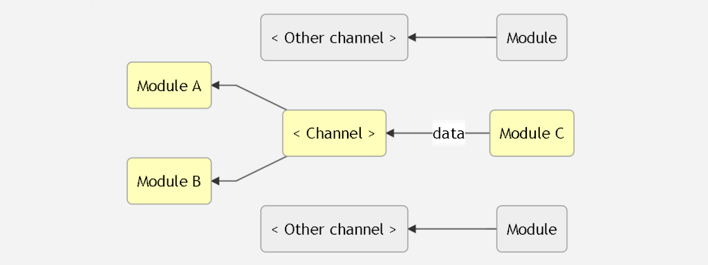

# Channel Manager Readme
Channel Manager is a JavaScript module, aimed to provide a standardized way of communication between different modules of the app. It suits apps that are build using **Pub-Sub** pattern.



## Why it is useful?
When developing an app that consists of several modules, one problem that might arise is that modules become too "dependent" on each other's code. For example, if you change function's name in one module, you will also need to change that name in all modules that imported that function from initial module. The problem even worsens, when multiple developers are working on the same app.

By using Pub-Sub design pattern and standardized ways of sharing data, components become more independent from each other, as one module does not need to know anything about other modules. All it needs to know is the **name** of data channel and in which **format** the data is sent through this channel.

## How it works?
**1. Download ChannelManager.js**

For this example let's call the module that sends data **sender.js** and component that receives the data - **receiver.js**. That's what we need to do to setup our data channel:

### In sender.js:
```
  import ChannelManager from <file-location> as CM

  CM.openChannel('channel-name');
  CM.sendData('channel-name', <your-data>);
```
### In receiver.js:
```
  import ChannelManager from <file-location> as CM

  CM.listen('channel-name', (data) => {
    console.log('Doing something with data');
  })
```
Now, every time `sender.js` sends new data, the callback that was passed to `.listen()` function is going to be triggered.

**And that's it!** That's all you need to start working with Channel Manager. Now you can connect new modules to your channel and all you have to do is to repeat the steps above.

*Note that you do not need to run `.openChannel()` function if you send data to existing channel.

## Methods
* `ChannelManager.openChannel( <channel-name:string> )`
Opens new channel. This function only needs to be run in first module. Has no effect when called again with same argument.

* `ChannelManager.exists( <channel-name:string> )`
Checks if channel with given name already exists. Output is **boolean**.

* `ChannelManager.sendData( <channel-name:string>, <data>, <?data-headers:object>)`
Sends data to the channel. It is highly recommended that data format is agreed between developers beforehands.
As third parameter, you can optionally mark your data with some object with information about the data. This might help receiver to decide how data should be processed.
**Example:**
```
  const data = ['Lion', 'Wolf', 'Moose'];

  const headers = {
    type: 'animals',
    domesticated: false,
    predators: 2,
    herbivorous: 1
  }

  CM.sendData('zoo', headers);
```

* `ChannelManager.listen( <channel-name:string>, <callback1:function>, ...<callbackN:function> )`
Specifies, which callbacks need to be run when new data is sent to the channel. Each callback function will receive a `data` argument and `data-headers` object as second optional argument.
**Example:**
```
  const callback = (data, headers) => {
    if (headers.predators > 0 && headers.herbivorous > 0) {
      console.log('Should be transported separately');
    } else {
      console.log('Can be transported together');
    }

    zoo.concat(data);
  }

  CM.listen('zoo', callback);
```

* `ChannelManager.listenOnce( <channel-name:string>, <callback1:function>, ...<callbackN:function> )`
Works same way as `.listen()` method, but callbacks fire only once;

* `ChannelManager.setFormat( <channel-name:string>, <format:keyword | object> )`
Sets the format, in which data can be sent through the channel. Keyword can be:
`'ANY'`,
`'STRING'`,
`'NUMBER'`,
`'BOOLEAN'`,
`'UNDEFINED'`,
`'ARRAY'`,
`'OBJECT'`,
`'FUNCTION'`,
`'BIGINT'`
 Also, data format can be an object with properties that must be present in data object. Like so:
 ```
 {
  width: 'NUMBER',
  height: 'NUMBER',
  color: 'STRING'
 }
 ```

 * `ChannelManager.getFormat( <channel-name:string> )`
 Outputs the data format of given channel. Output is keyword **string** or **object**.

 * `ChannelManager.closeChannel( <channel-name:string> )`
 Closes the data channel.
